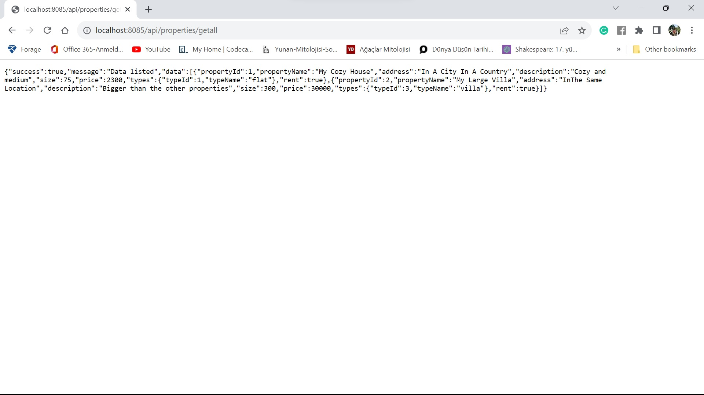
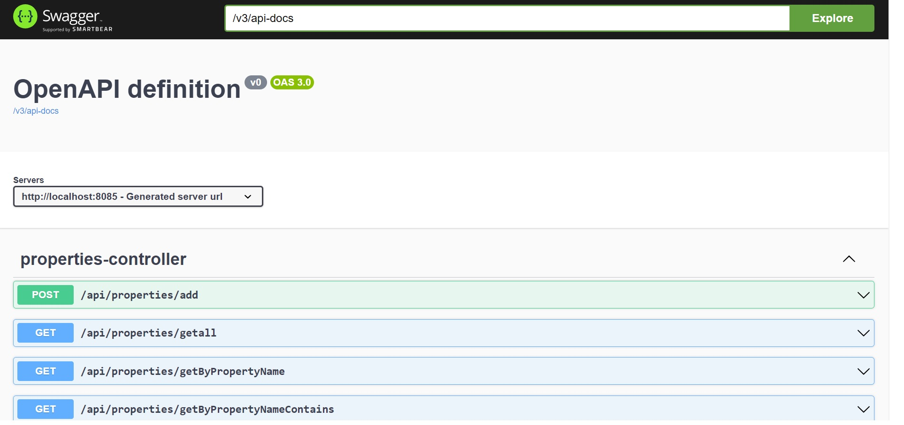
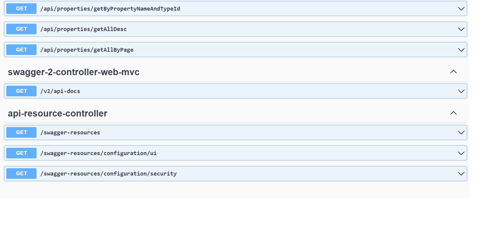
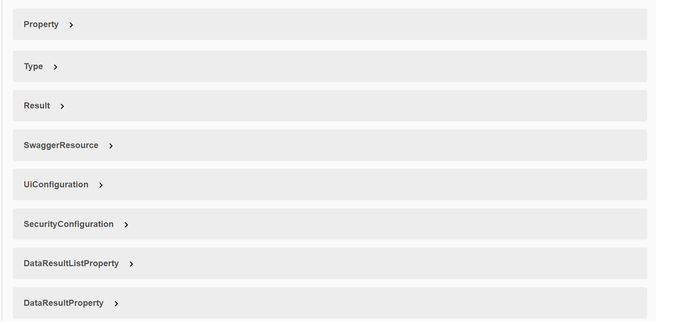
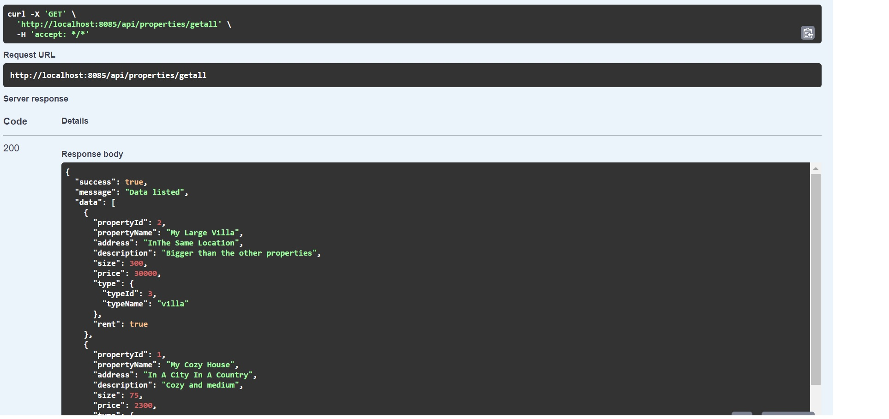
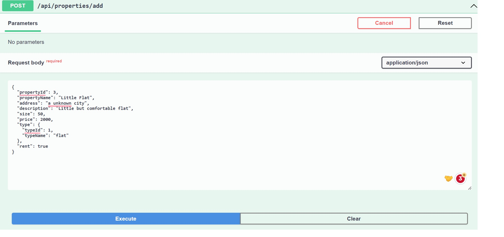
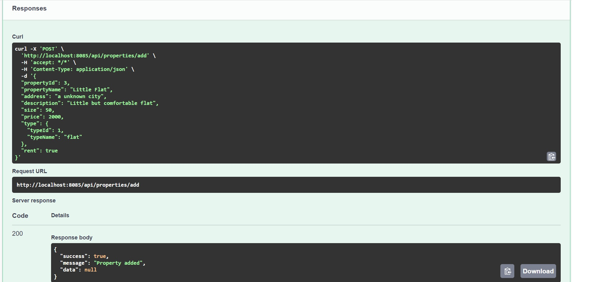
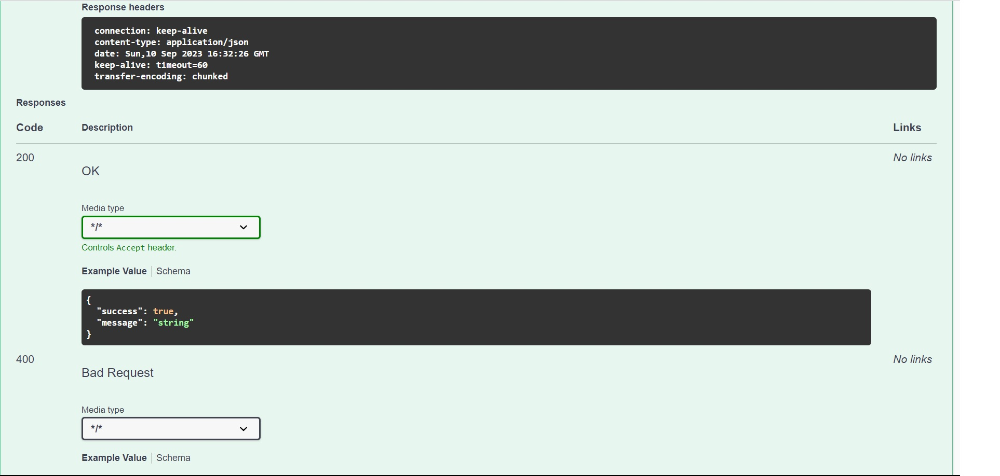
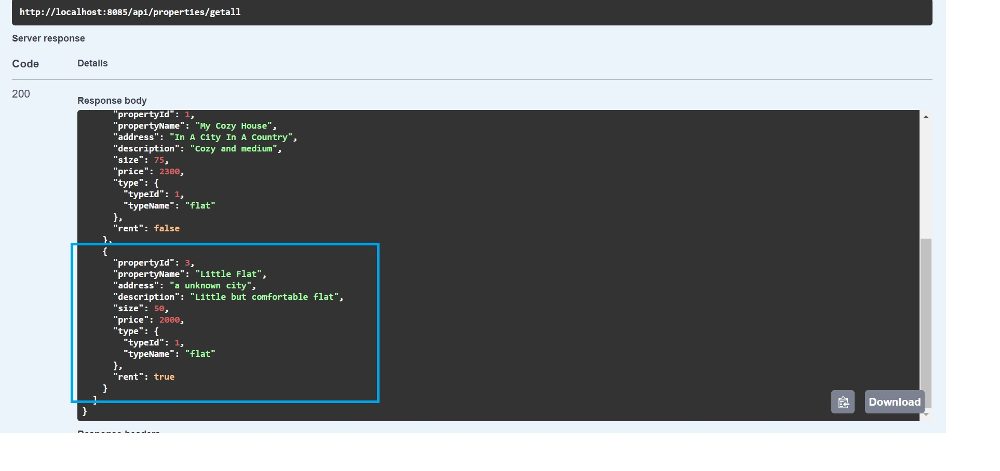
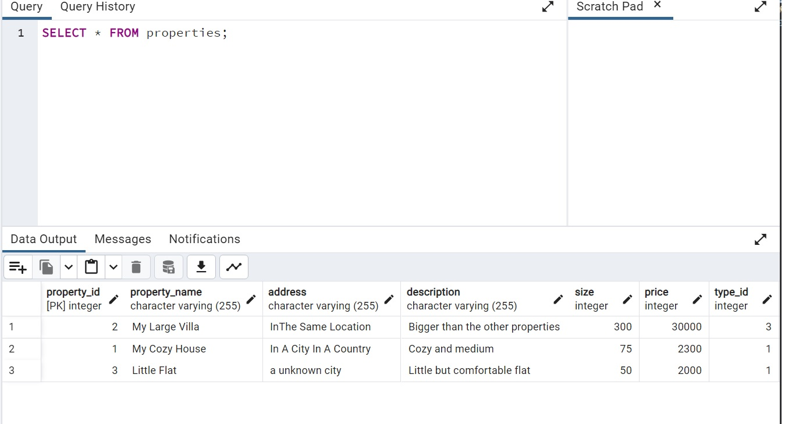

Firstly, Property and Type object classes are created. 
Property class represent identical houses.
Type class is created in order to assign house types such as villa, flat or residence into properties.
DataAccess layer is created for connecting project with the database and decide getting choices. Dao class in this layer is used as a repository.
Business layer is created to write business rules.
Service interface provide a baseline for methods in manager class. By this, the dependency can be broken in case.
In PropertyDao, query methods is written to represent SELECT method in PostgreSql.
Dto layer contains PropertyWithTypeDto class. This class provide all details of properties. Its rules is written in service and manager classes.
The controller layer and class provide api connection. Via these, url can be choosen for testing and posting.
Core layer contains classes and packages that are used in all project. Specially, succes and error messages are hold here.
DemoApplication class is the main class. Project counts to back from this class and all areas are reached.
Using Swagger-ui dependency, business codes are tested.  

